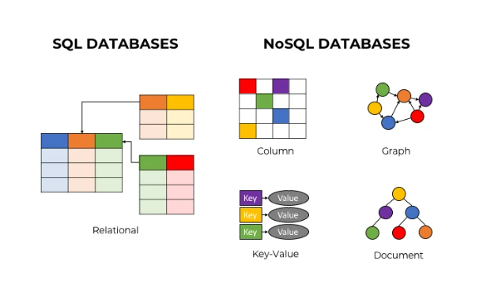

# Cơ sở dữ liệu

## Đề bài: Tìm hiểu về csdl

### Thực hiện bởi: [Nguyễn Đoàn Đăng](https://github.com/dnang36)

### Download code và run code tại đường dẫn https://github.com/dnang36/csdl

### Kiến thức thu được:

## 1.DBMS:
- DBMS là viết tắt của Database Management System, dịch sang tiếng Việt là Hệ quản trị Cơ sở dữ liệu. DBMS là phần mềm được thiết kế để có thể xác định, tiến hành các thao tác, truy xuất và quản lý dữ liệu trong Cơ sở dữ liệu
- DBMS thường có khả năng tự thao tác với dữ liệu, định dạng dữ liệu, tên trường, cấu trúc bản ghi và cấu trúc tệp. Nó cũng xác định các quy tắc để xác nhận và thao tác với dữ liệu.
- Với DBMS, người dùng có thể thao tác sửa/xóa/thêm dữ liệu mà không còn cần các chương trình khung. Các ngôn ngữ lập trình truy vấn như SQL thường đi kèm với DBMS để lập trình viên dễ dàng tương tác với dữ liệu họ cần.
- Một vài DBMS phổ biến:
  - MySQL
  - SQL Server
  - Oracle
  - dBASE
  - Fox
## 2.SQL
- Viết tắt của Structured Query Language là ngôn ngữ truy vấn có cấu trúc. Nó là một ngôn ngữ, là tập hợp các lệnh để tương tác với cơ sở dữ liệu. Dùng để lưu trữ, thao tác và truy xuất dữ liệu được lưu trữ trong một cơ sở dữ liệu quan hệ.
- SQL là ngôn ngữ chuẩn được sử dụng hầu hết cho hệ quản trị cơ sở dữ liệu.
- Các kiểu dữ liệu trong SQL:

| kiểu dữ liệu  | Tên                              | Ví Dụ                                                                                                                    |
|---------------|----------------------------------|--------------------------------------------------------------------------------------------------------------------------|
| int           | Số Nguyên                        | VD:3;6;8                                                                                                                 |
| float         | Số Thực                          | VD:3.6;1.2                                                                                                               |
| varchar(size) | Chuỗi                            | Giả sử varchar(50) thì chuỗi tối đa có 50 kí tự (do máy cấp), nhưng nếu không dùng hết thì máy sẽ tự rút ngắn bộ nhớ lại |
| boolean       | kiểu đúng sai                    | Có 2 giá trị: 1 và 0                                                                                                     |
| text          | chuỗi                            | Là chuỗi nhưng cho văn bản dài, không cần khai báo có bao nhiêu kí tự                                                    |
| date          | năm - tháng - ngày               | VD: 2018 - 01 - 01                                                                                                       |
| datetime      | năm - tháng - ngày giờ:phút:giây | VD: 2018 - 01 - 01 23:59:59                                                                                              |
| time          | giờ:phút:giây                    | VD: 23:59:59                                                                                                             |

- các ràng buộc (constraint) trong SQL: là những quy tắc được áp dụng trên các cột dữ liệu, trên bảng. Được sử dụng để kiểm tra tính hợp lệ của dữ liệu vào, đảm bảo tính chính xác, tính toàn vẹn của dữ liệu.

| Ràng buộc      | tên                                     | ý nghĩa                                                                                                                                                                                      |
|----------------|-----------------------------------------|----------------------------------------------------------------------------------------------------------------------------------------------------------------------------------------------|
| unique         | duy nhất                                | Dùng cho cột (một hoặc nhiều) để không được trùng, không được lặp lại, được phép null                                                                                                        |
| primary key    | khoá chính                              | Dùng cho cột (một hoặc nhiều) để không được trùng, không được null                                                                                                                           |
| foreign key    | khoá ngoại                              | Dùng cho cột (một hoặc nhiều) để nối với khoá chính bảng khác, được phép null                                                                                                                |
| not null       | khác null                               | Không được để null                                                                                                                                                                           |
| unsigned       | không ký tự                             | Không có dấu trừ => Không được âm                                                                                                                                                            |
| auto_increment | tự động tăng                            | "Không điền sẽ tự động tăng (vẫn sẽ tăng dù đã xoá bản ghi cũ) Bắt buộc phải là khoá chính và mỗi bảng chỉ có 1 cái này"                                                                     |
| check          | kiểm tra điều kiện khi cập nhật dữ liệu | "VD: cột điểm: điểm lớn hơn bằng 0 và nhỏ hơn bằng 10: diem float check (diem>=0 and diem<=10),tên sinh viên: độ dài tên trên 5:ten_sinh_vien nvarchar(50) check ( len(ten_sinh_vien) > 5 )" |
| default        | mặc định giá trị khi insert để trống    | "VD: cột điểm: diem float default 5 khi insert: insert into diem (ma_sinh_vien) values (1) thì sinh viên mã = 1 sẽ có điểm là 5"                                                             |

- Các mối quan hệ trong SQL: được sử dụng để mô tả các mối quan hệ tồn tại giữa các bảng trong cơ sở dữ liệu quan hệ.
  - quan hệ một - một: Mối quan hệ một-một trong cơ sở dữ liệu xảy ra khi mỗi hàng trong bảng 1 chỉ có một hàng liên quan trong bảng 2.
  - quan hệ một - nhiều: Mối quan hệ một-nhiều xảy ra khi một bản ghi trong bảng 1 có liên quan đến một hoặc nhiều bản ghi trong bảng 2. Tuy nhiên, một bản ghi trong bảng 2 không thể liên quan đến nhiều hơn một bản ghi trong bảng 1
  - quan hệ nhiều - nhiều: Mối quan hệ nhiều-nhiều xảy ra khi nhiều bản ghi trong một bảng có liên quan đến nhiều bản ghi trong bảng khác.

- Hàm tổng hợp dữ liệu (Aggregate Functions) trong SQl:là một hàm trong đó các giá trị của nhiều hàng được gom nhóm lại với nhau để làm đầu vào cho các tiêu chí nhất định để tạo thành một giá trị duy nhất có ý nghĩa quan trọng hơn. 
  - COUNT: đếm số lượng bản ghi,
  - SUM: được sử dụng để tính tổng của một trường trong các bản ghi khác nhau.
  - AVG: được sử dụng để tính giá trị trung bình của một trường trong các bản ghi khác nhau.
  - MIN: được sử dụng để tìm ra bản ghi có giá trị nhỏ nhất trong một tập hợp bản ghi.
  - MAX: được sử dụng để tìm ra bản ghi có giá trị lớn nhất trong một tập hợp bản ghi.

- Các câu lệnh SQL(query): Các lệnh SQL tiêu chuẩn để tương tác với cơ sở dữ liệu quan hệ là CREATE, SELECT, INSERT, UPDATE, DELETE và DROP. Các lệnh này có thể được phân thành các nhóm sau dựa trên bản chất của chúng
  - DDL(Ngôn ngữ định nghĩa dữ liệu):

| Lệnh   | Mô tả                                                                |
|--------|----------------------------------------------------------------------|
| CREATE | Tạo ra một bảng mới hoặc các đối tượng khác trong cơ sở dữ liệu.     |
| ALTER  | Sửa đổi một đối tượng cơ sở dữ liệu hiện có, chẳng hạn như một bảng. |
| DROP   | Xoá toàn bộ một bảng hoặc các đối tượng khác trong cơ sở dữ liệu.    |

````sql
// tạo bảng nhân viên:
create table nhan_vien(
ma_nv int auto_increment,
ten_nv varchar(50),
primary key (ma_nv)
)

// thêm cột tuổi vào bảng nhân viên:
alter table nhan_vien add column tuoi

// xoá bảng
drop table nhan_vien
````

- DML(Ngôn ngữ thao tác dữ liệu) :

| Lệnh   | Mô tả                                                 |
|--------|-------------------------------------------------------|
| SELECT | Lấy ra các bảng ghi nhất định từ một hoặc nhiều bảng. | 
| INSERT | Tạo một bảng ghi..                                    |
| UPDATE | Chỉnh sửa bảng ghi.                                   |
| DELETE | Xóa bảng ghi.                                         |

````sql
--thêm bản ghi
insert into nhan_vien (ten_nhan_vien) values ('dang')

--lấy bản ghi
select * from nhan_vien --Lấy tất cả các bản ghi + tất cả các cột

select ten_nhan_vien from nhan_vien --Lấy tất cả các bản ghi với cột tên

--Cập nhật bản ghi bảng nhân viên
update nhan_vien set ten_nhan_vien='xyz' where ma_nhan_vien=1

--Xoá bản ghi bảng nhân viên
delete from nhan_vien where ma=2

````

- Truy vấn con (Subquery): Một truy vấn con là một truy vấn được chứa trong một truy vấn khác. Truy vấn bên trong thường được sử dụng để xác định kết quả của truy vấn bên ngoài.

- Transaction SQL :là tiến trình thực hiện một nhóm các câu lệnh SQL. Các câu lệnh này được thực thi một cách tuần tự và độc lập. Một Transaction được thực hiện thành công khi tất cả câu lệnh đều thành công, khi đó tất cả các thay đổi dữ liệu được thực hiện trong Transaction được lưu vào cơ sở dữ liệu. Tuy nhiên, nếu chỉ một trong số đó thất bại thì toàn bộ tiến trình sẽ thất bại, đồng nghĩa với việc dữ liệu phải rollback về trạng thái ban đầu (dữ liệu được khôi phục về trạng thái trước khi thực hiện Transaction).
  - COMMIT: để lưu các thay đổi.
  - ROLLBACK: để quay trở lại trạng thái trước khi có thay đổi.
  - SAVEPOINT: tạo các điểm (point) bên trong các nhóm Transaction để ROLLBACK, tức là để quay trở lại điểm trạng thái đó.
  - SET TRANSACTION: đặt một tên cho một Transaction.

3. Cơ sở dữ liệu NoSQL là gì?
- Cơ sở dữ liệu NoSQL là một Hệ thống quản lý dữ liệu không quan hệ (non-relational Data Management System) có lược đồ (schema) linh hoạt. 
- Nó dễ mở rộng. Mục đích chính của việc sử dụng cơ sở dữ liệu NoSQL là dành cho các kho dữ liệu phân tán với nhu cầu lưu trữ dữ liệu lớn. NoSQL được sử dụng cho Dữ liệu lớn và ứng dụng web thời gian thực
- Cơ sở dữ liệu NoSQL là viết tắt của “Not Only SQL” hoặc “Not SQL”. Với cơ sở dữ liệu quan hệ RDBMS ta sử dụng cú pháp SQL để lưu trữ và truy xuất dữ liệu. Đối với hệ thống cơ sở dữ liệu NoSQL, nó bao gồm một loạt các công nghệ cơ sở dữ liệu có thể lưu trữ dữ liệu có cấu trúc, bán cấu trúc, phi cấu trúc và đa hình.



- Phân loại:
  - Key - Value:
  - Column-based:
  - Document-Oriented:
  - Graph-Based:
  - 
